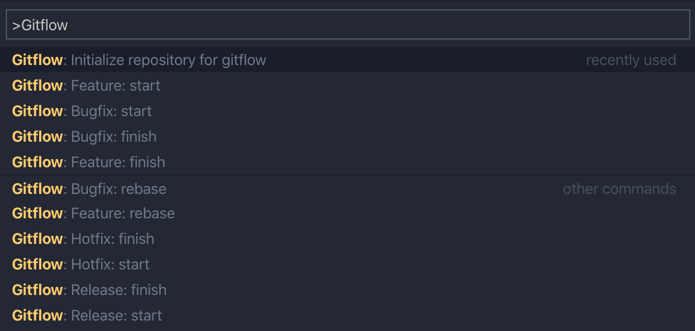

# Gitflow integration for Visual Studio Code

[](https://marketplace.visualstudio.com/items?itemName=buianhthang.gitflow)   

This extension provides integration and support for [gitflow](http://nvie.com/posts/a-successful-git-branching-model/). It is based on [this gitflow implementation](https://github.com/nvie/gitflow) and intends to be fully compatible with it.

## ✨ What's new
* Workspace support 🥳
* Squash feature during merge (default: false)
* Fast-forward merge feature into develop branch if only 1 commit
* Better error message

### 📒 Todoist
* Setting to allow fast-forward merge feature
* Add gitflow funtions into SCM

## 🏁 Getting Started

If you already have gitflow set up for your repository, just start execcuting gitflow commands from the Command Palette!



## 🎬 Starting from Scratch

1. First, initialize git:
```sh
$ git init
```
2. Open the VS Code Command Palette and type 'gitflow'

3. Select 'Initialize repository for gitflow'

4. Follow the command prompts and accept the defaults...


5. Setup complete!

## 📝 Note

Forked from [vector-of-bool/vscode-gitflow](https://github.com/vector-of-bool/vscode-gitflow).

Icons made by [Flat Icons](https://www.flaticon.com/authors/flat-icons) from [www.flaticon.com](https://www.flaticon.com/)
